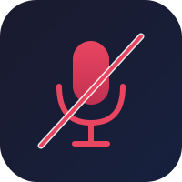
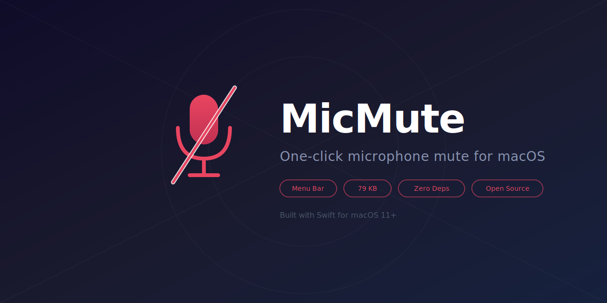

<p align="center">
  
</p>

<h1 align="center">MicMute</h1>

<p align="center">
  <strong>One-click microphone mute/unmute for macOS menu bar</strong>
</p>

<p align="center">
  <a href="#installation"></a>
  <a href="LICENSE"></a>
  <a href="MicMute.swift"></a>
  <a href="MicMute.swift"></a>
  <a href="#installation"></a>
</p>

<p align="center">
  
</p>

---

## Why MicMute?

Ever been in a Zoom call and couldn't find the mute button fast enough? MicMute lives in your **macOS menu bar** and lets you **mute/unmute your microphone with a single click**. No more fumbling through app windows.

- **Instant toggle** — Left-click the icon to mute/unmute. No menus, no delays.
- **Visual feedback** — Icon changes between 🎤 and 🔇 so you always know your mic status.
- **Lightweight** — 79 KB binary compiled from a single Swift file. No Electron, no bloat.
- **Zero dependencies** — Built with native macOS APIs. Nothing to install except the app itself.
- **Remembers volume** — Restores your previous input volume when you unmute.
- **Auto-start** — Optional login item to start automatically when you boot your Mac.
- **Privacy-first** — Runs locally, no network access, no analytics, no data collection.

## How It Works

<p align="center">
  
  <br>
  
</p>

| Action | Result |
|--------|--------|
| **Left-click** | Toggle microphone mute/unmute |
| **Right-click** | Show quit menu |

## Installation

### Quick Install (recommended)

```bash
git clone https://github.com/bahmetpalanci/mic-mute.git
cd mic-mute
bash build.sh
open MicMute.app
```

### Auto-Start on Login

```bash
bash install.sh
```

### Uninstall

```bash
bash uninstall.sh
```

### Requirements

- macOS 11 (Big Sur) or later
- Xcode Command Line Tools (`xcode-select --install`)

## Build from Source

MicMute is a single Swift file that compiles to a native macOS app:

```bash
# Clone
git clone https://github.com/bahmetpalanci/mic-mute.git
cd mic-mute

# Build (creates MicMute.app)
bash build.sh

# Run
open MicMute.app
```

The entire source code is in [`MicMute.swift`](MicMute.swift) — less than 100 lines.

## Project Structure

```
mic-mute/
├── MicMute.swift          # Complete source code (single file)
├── build.sh               # Build script
├── install.sh             # Install as login item
├── uninstall.sh           # Remove login item
├── MicMute.app/           # Compiled app bundle
│   └── Contents/
│       ├── Info.plist
│       └── MacOS/MicMute
├── assets/                # Logo and screenshots
└── README.md
```

## How It's Built

MicMute uses native macOS APIs:

- **`NSStatusItem`** — Places the icon in the menu bar
- **SF Symbols** — Native `mic.fill` and `mic.slash.fill` icons
- **`NSApplication.setActivationPolicy(.accessory)`** — Hides from Dock
- **AppleScript bridge** — Controls system input volume via `osascript`
- **LaunchAgent** — Auto-start on login via standard macOS mechanism

No frameworks, no package managers, no build systems. Just `swiftc`.

## FAQ

<details>
<summary><strong>Does it work with all apps?</strong></summary>
Yes. MicMute controls the system-wide input volume, so it affects all applications — Zoom, Teams, Discord, FaceTime, and any other app that uses your microphone.
</details>

<details>
<summary><strong>Does it need microphone permission?</strong></summary>
No. MicMute doesn't access the microphone directly — it only controls the system input volume level through AppleScript.
</details>

<details>
<summary><strong>Can I use a keyboard shortcut?</strong></summary>
Not built-in yet, but you can easily set one up with macOS Automator or Shortcuts by running: <code>osascript -e 'set volume input volume 0'</code> to mute and <code>osascript -e 'set volume input volume 100'</code> to unmute.
</details>

<details>
<summary><strong>How do I stop it?</strong></summary>
Right-click the menu bar icon and select "Quit MicMute". To remove auto-start, run <code>bash uninstall.sh</code>.
</details>

## Alternatives

| App | Size | Price | Open Source |
|-----|------|-------|-------------|
| **MicMute** | **79 KB** | **Free** | **Yes** |
| Mutify | 15 MB | $3.99 | No |
| Mute Me | 8 MB | Free | No |
| SoundSource | 25 MB | $39 | No |

## Contributing

Contributions are welcome! Feel free to open an issue or submit a pull request.

## License

[MIT](LICENSE) — Use it however you want.

---

<p align="center">
  <sub>Built with ❤️ using Swift and native macOS APIs</sub>
</p>
